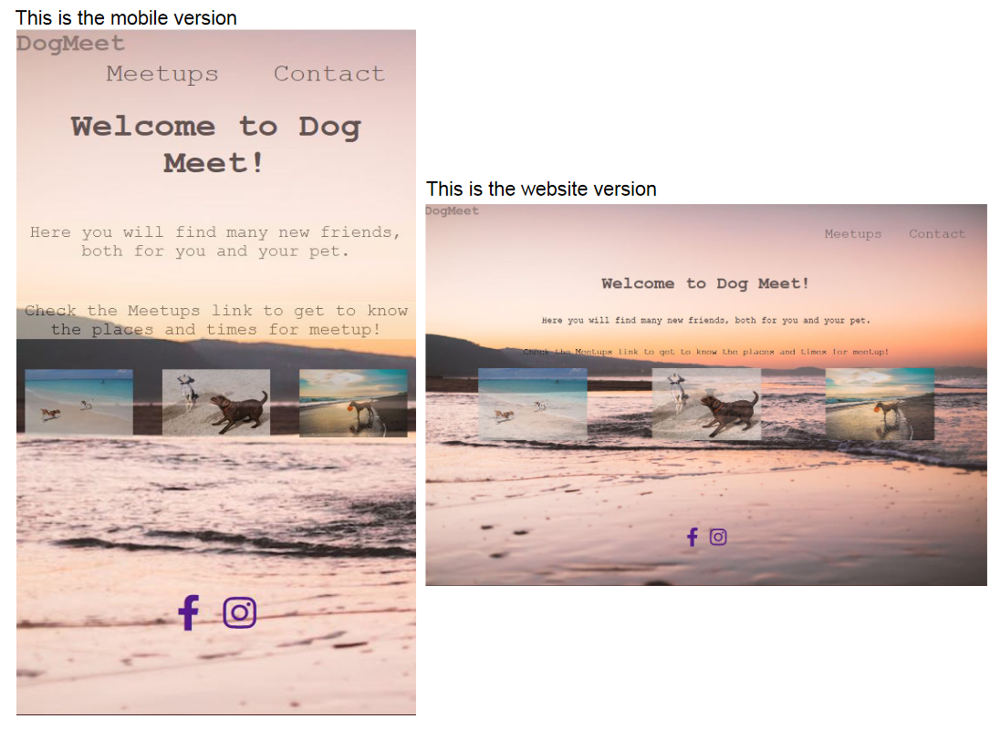
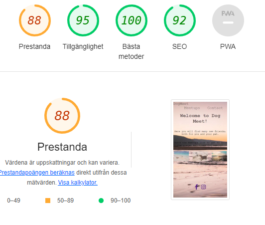

# Welcome to Dog Meet!

This site is created to get together dogowners with their dogs in Abu Dhabi.

Dog Meet gives dog owners the opportunity to select meetings that repeats every week. 

  ## Features 

  Dog Meet´s has three different parts. The first is the homepage which contains a navigation bar at the top of the page, in the center a heading and three pictures of dogs. At the botton of the page is the social media links to the facebook and instagram.

  The Meetups page shows the five different places to meet, this meetups is consistent every week.

  ## Existing Features

  ### <li>Navigation Bar

  * Displayed in all three pages with Home page, Contact and Meetups for easy navigation trough the site. The page you´re in does not show in the navigation bar. 

  

### <li> The homepage heading

* The header section in the home page includes a short description of the purpose of this website and three different pictures of dogs below it.

## Social Links

* Simple social links to easy navigate to our social media.

## The meetups site

* Gives the user exact places, times for each meetup.

* These meetups will happen at the same place and times every week, so no updates are required.

## Contact site

* Give the user contact information

* Let the user send a direct message

  # Testing

  * The website works on all the regular websites such as: Firefox, Google Chrome and Microsoft Edge.
  * The site is responsive on all standard screen sizes.
  * The text is throughout clearly readable.

# Validator Testing
<li> HTML

* Succeed the tests with [W3C validator](https://validator.w3.org/nu/#textarea)

<li> CSS

* Succeed the tests with [(Jigsaw) validator](https://jigsaw.w3.org/css-validator/validator)
  
## Unfixed Bugs
No unfixed bugs.

# Deployment

<li> Navigate to the repositery in GitHub, click on Settings and on the left menu at the bottom push the Pages button.
<li> Deploy from the Main branch and press save.

# Credits
I have been using [W3School](https://www.w3schools.com/) to get some extra help on the syntax. The Code Institute has given me the information I need to create the meetups section.

## Content 
The icons for the social links are taken from [Font Awesome](https://fontawesome.com/)

## Media

All the photos in this project are taken from [Pexels](https://www.pexels.com/sv-se/)

